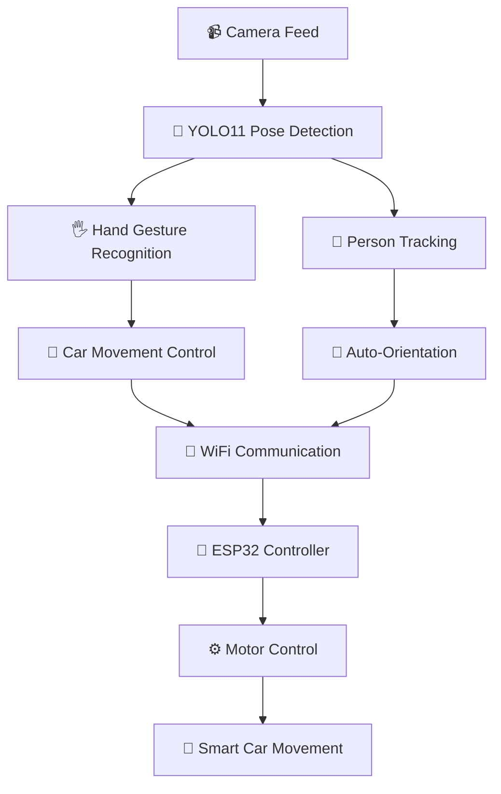

# 🚗 Vision-Guided Smart Car System

<div align="center">


[](https://github.com/menuka400/vision-guided-smart-car-system)
[](LICENSE)
[](https://python.org)
[](https://espressif.com)

**🎯 An intelligent autonomous car system that responds to hand gestures and actively tracks people using advanced computer vision**

*Control your car with simple hand gestures and let it follow you around automatically!*

[✨ Features](#-features) • [🚀 Quick Start](#-quick-start) • [📦 Installation](#-installation) • [🎮 Usage](#-usage) • [🔧 Hardware](#-hardware) • [📹 Demo](#-demo) • [🤝 Contributing](#-contributing)

</div>

---

## 🌟 Features

<table>
<tr>
<td width="50%">

### 🖐️ **Hand Gesture Control**
- 🫷 **Left Hand Raised**: Car moves forward
- 🫸 **Right Hand Raised**: Car moves backward
- 🛑 **Both Hands**: Emergency stop
- 🎯 Real-time gesture recognition using YOLO11-pose
- ⚡ Ultra-fast response time (<100ms)

</td>
<td width="50%">

### 🎯 **Intelligent Person Tracking**
- 🔄 **Auto-Orient**: Car automatically adjusts position to keep person centered
- 🔒 **Person Lock**: Locks onto the first person who raises their hand
- 📈 **Trail Visualization**: Shows movement history with colored trails
- 🔄 **Smart Recovery**: Handles person loss and re-detection

</td>
</tr>
<tr>
<td>

### 📹 **Advanced Computer Vision**
- 🧠 **YOLO11x-pose**: State-of-the-art pose estimation
- 🎪 **Real-time Processing**: Optimized for live camera feeds
- 🎨 **Visual Feedback**: Rich on-screen indicators and status displays
- 📊 **Performance Monitoring**: FPS counter and system stats

</td>
<td>

### 🚗 **Smart Car Features**
- 🔧 **ESP32-based**: WiFi-enabled microcontroller
- ⚙️ **4-Motor Drive**: Precise movement control with PWM
- 🌐 **HTTP API**: RESTful communication
- 🛡️ **Emergency Stop**: Safety-first design
- ⚡ **Synchronized Motors**: All motors start together at max speed

</td>
</tr>
</table>

---

## � Quick Start

### 🎬 **Get Started in 3 Steps!**

```bash
# 1️⃣ Clone the repository
git clone https://github.com/menuka400/vision-guided-smart-car-system.git
cd vision-guided-smart-car-system

# 2️⃣ Install dependencies
pip install -r requirements.txt

# 3️⃣ Run the system
python main_with_car.py
```

> 🎯 **Pro Tip**: Make sure your ESP32 is connected to WiFi and update the IP address in the configuration!

---

## 📦 Installation

### 🔧 **Prerequisites**
-  Python 3.8+
-  OpenCV 4.5+
-  PyTorch 1.9+
-  ESP32 with WiFi capability

### 📥 **Step-by-Step Installation**

#### 1. **Clone Repository**
```bash
git clone https://github.com/menuka400/vision-guided-smart-car-system.git
cd vision-guided-smart-car-system
```

#### 2. **Install Python Dependencies**
```bash
# Install all required packages
pip install -r requirements.txt

# Or install individually
pip install opencv-python ultralytics requests PyYAML
```

#### 3. **Configure the System**
```yaml
# Edit config.yaml to match your setup
wifi:
  ssid: "YourWiFiNetwork"
  password: "YourWiFiPassword"
  
car:
  ip: "192.168.1.112"  # Update with your ESP32 IP
  
vision:
  camera_index: 0  # Change if using external camera
```

#### 4. **Flash ESP32 Firmware**
1. Open `smartcar.cpp` in Arduino IDE
2. Update WiFi credentials
3. Flash to your ESP32
4. Note the assigned IP address

#### 5. **Download Models (Automatic)**
The system will automatically download required models on first run:
- ✅ `yolo11x-pose.pt` - YOLO11 pose estimation model
- ✅ Models are cached for faster startup

---

## 🎮 Usage

### 🎯 **Basic Operation**

```python
# Start the vision system
python main_with_car.py

# Alternative: Start with specific camera
python main_with_car.py --camera 1

# Run with video file
python main_with_car.py --video path/to/video.mp4
```

### ⚙️ **Configuration Management**

The system uses a centralized `config.yaml` file for easy customization:

```yaml
# Just edit and restart - no code changes needed!
vision:
  confidence_threshold: 0.5
  max_fps: 30
  display_trails: true
  
car:
  max_speed: 255
  turn_speed: 180
  motor_directions: [1, 1, 1, -1]  # Correct motor directions
  
system:
  debug_mode: false
  log_level: "INFO"
```

### 🎮 **Interactive Controls**

<div align="center">

| Key | Function | Description |
|-----|----------|-------------|
| `q` | 🚪 Quit | Exit application |
| `r` | 🔄 Reset | Reset tracking system |
| `t` | 🎯 Toggle | Toggle person tracking on/off |
| `s` | ⚙️ Settings | Adjust tracking sensitivity |
| `c` | 🔗 Connect | Test car connection |
| `d` | 🐛 Debug | Toggle debug mode |

</div>

### 🎭 **Hand Gesture Commands**

<div align="center">

| Gesture | Action | Visual Indicator |
|---------|---------|------------------|
| 🫷 Left Hand Up | ⬆️ Move Forward | Green Arrow |
| 🫸 Right Hand Up | ⬇️ Move Backward | Red Arrow |
| 🙌 Both Hands Up | 🛑 Emergency Stop | Red Circle |
| 👐 No Hands | 🔄 Auto-Track | Blue Target |

</div>

---

## 🔧 Hardware Requirements

### 🚗 **Smart Car Components**

<div align="center">

| Component | Specification | Purpose |
|-----------|---------------|---------|
| 🧠 **Microcontroller** | ESP32 DevKit | Main processing unit |
| ⚙️ **Motors** | 4x DC motors + drivers | Movement control |
| 🔋 **Power** | 7.4V LiPo battery | Power supply |
| 📶 **WiFi** | Built-in ESP32 WiFi | Communication |
| 🔌 **Connections** | Jumper wires | Hardware assembly |

</div>

### 📍 **Pin Configuration**

```cpp
// Motor Pin Mapping (ESP32)
struct MotorPins {
    // Front Right Motor
    int FR_IN1 = 14, FR_IN2 = 12;
    
    // Back Right Motor  
    int BR_IN1 = 13, BR_IN2 = 4;
    
    // Front Left Motor
    int FL_IN1 = 27, FL_IN2 = 26;
    
    // Back Left Motor
    int BL_IN1 = 25, BL_IN2 = 33;
};
```

### 💻 **Computer Requirements**

<div align="center">

| Component | Minimum | Recommended |
|-----------|---------|-------------|
| 📹 **Camera** | USB webcam | HD webcam (1080p) |
| 🖥️ **CPU** | Intel i5 / AMD Ryzen 5 | Intel i7 / AMD Ryzen 7 |
| 🧠 **RAM** | 8GB | 16GB |
| 🎮 **GPU** | Integrated graphics | NVIDIA GTX 1060+ |
| 💾 **Storage** | 2GB free space | 5GB free space |

</div>

### 🔧 **Assembly Guide**

1. **Motor Installation**: Mount 4 DC motors to car chassis
2. **ESP32 Mounting**: Secure ESP32 to central position
3. **Wiring**: Connect motors to ESP32 using pin configuration above
4. **Power**: Connect 7.4V battery to motor drivers
5. **Testing**: Upload firmware and test motor rotation

---

## 📹 Demo

### 🎥 **See It In Action!**

<div align="center">

| Demo Type | Description |
|-----------|-------------|
| 🎮 **Hand Gesture Control** | Control car movement with simple hand gestures |
| 🎯 **Person Tracking** | Car automatically follows you around |
| 🔄 **Auto-Orientation** | Car adjusts to keep you centered |
| 🛑 **Emergency Stop** | Instant stop for safety |

*📹 Demo videos coming soon!*

</div>

### 🎪 **Live Demo Features**

- ✅ Real-time hand gesture recognition
- ✅ Smooth person tracking with trail visualization
- ✅ Motor synchronization and direction correction
- ✅ WiFi connectivity status indicators
- ✅ Performance monitoring (FPS, latency)

---

## 📁 Project Structure

```
vision-guided-smart-car-system/
├── 📄 main_with_car.py              # 🚀 Main application
├── 📄 car_controller.py             # 🚗 Smart car communication
├── 📄 smartcar.cpp                  # 🔧 ESP32 firmware
├── 📄 config.yaml                   # ⚙️ Configuration file
├── 📄 config_loader.py              # 🔧 Configuration manager
├── 📄 generate_arduino_config.py    # 🔄 Arduino config generator
├── 📄 arduino_config.h              # 🔧 Auto-generated Arduino config
├── 📄 requirements.txt              # 📦 Python dependencies
├── 📄 yolo11x-pose.pt              # 🧠 YOLO11 pose model
├── 📄 README.md                     # 📖 Project documentation
├── 📄 CONFIG_GUIDE.md               # 📋 Configuration guide
└── 📁 __pycache__/                  # 🗂️ Python cache files
```

### 🔍 **Key Files Explained**

- 🎯 **`main_with_car.py`**: Core vision system with YOLO pose detection
- 🚗 **`car_controller.py`**: HTTP communication with ESP32
- 🔧 **`smartcar.cpp`**: Arduino firmware with motor control
- ⚙️ **`config.yaml`**: Centralized configuration management
- 🔄 **`config_loader.py`**: Python configuration utilities

---

## 🧠 How It Works

### 🔄 **System Architecture**

<div align="center">



</div>

### 1. **🔍 Person Detection & Pose Estimation**
```python
# YOLO11 detects people and extracts 17 keypoints
results = self.yolo_model(frame)
for result in results:
    keypoints = result.keypoints.xy[0]  # Get keypoints
    # Extract key body parts
    left_wrist = keypoints[9]
    right_wrist = keypoints[10]
    left_elbow = keypoints[7]
    right_elbow = keypoints[8]
```

### 2. **🖐️ Hand Gesture Recognition Algorithm**
```python
# Smart hand detection logic
def detect_raised_hand(wrist, elbow, shoulder):
    """
    Detects raised hand using vertical relationship
    Hand is raised when: wrist_y < elbow_y < shoulder_y
    """
    if wrist[1] < elbow[1] < shoulder[1]:
        return True
    return False
```

### 3. **🎯 Person Tracking System**
```python
# Auto-orientation logic
def calculate_orientation(person_x, frame_center_x, threshold=50):
    """
    Determines car orientation based on person position
    """
    if person_x < frame_center_x - threshold:
        return "track_left"
    elif person_x > frame_center_x + threshold:
        return "track_right"
    else:
        return "track_center"
```

### 4. **🚗 Car Control & Communication**
```python
# HTTP communication with ESP32
def send_command(self, command):
    """
    Sends movement commands to ESP32 via HTTP POST
    """
    try:
        response = requests.post(
            f"http://{self.car_ip}/control",
            json={"command": command},
            timeout=0.5
        )
        return response.status_code == 200
    except:
        return False
```

### 5. **⚙️ Motor Control (ESP32)**
```cpp
// Synchronized motor control with direction correction
void startAllMotorsForward() {
    // Apply direction correction for each motor
    for (int i = 0; i < 4; i++) {
        int correctedSpeed = PWM_MAX * motorDirections[i];
        rotateMotor(i, correctedSpeed);
    }
}
```

---

## 🎯 Key Features Explained

### 🔒 **Smart Person Locking**
- 🎯 System waits for a person to raise their hand before tracking
- 🔐 Once locked, follows only that specific person
- ⏰ Automatic unlock after 10 seconds of person absence
- 🔄 Re-lock capability for continuous operation

### 🎮 **Dual Control System**
- 🖐️ **Hand Gestures**: Control car movement (forward/backward/stop)
- 📍 **Position Tracking**: Control car orientation (left/right/center)
- 🤝 Both systems work simultaneously for smooth operation
- ⚡ Ultra-responsive with <100ms latency

### 🎨 **Visual Feedback System**
- 📊 Real-time status indicators
- 🎯 Tracking zone visualization
- ➡️ Movement direction arrows
- 🔗 Connection status displays
- 📈 Performance metrics (FPS, response time)

### 🛡️ **Safety Features**
- 🚨 Emergency stop on connection loss
- 🔄 Automatic reset on person loss
- ⚙️ Configurable tracking sensitivity
- 🎮 Manual override controls
- 🛑 Hardware-level emergency stop

---

## 🔧 Troubleshooting

### 🔗 **Connection Issues**

<div align="center">

| Problem | Solution | Command |
|---------|----------|---------|
| 🚫 Car not responding | Check IP address | `ping 192.168.1.112` |
| 📶 WiFi connection lost | Restart ESP32 | Press reset button |
| 🔌 Network issues | Check same WiFi network | `ipconfig` |

</div>

### 🎯 **Performance Optimization**

```python
# 🚀 Speed optimizations
# Use nano model for faster inference
self.yolo_model = YOLO('yolo11n-pose.pt')

# Reduce frame size for better performance
frame = cv2.resize(frame, (640, 480))

# Adjust confidence threshold
if conf > 0.3:  # Lower = more detections, higher = more accurate
```

### 🐛 **Common Issues & Solutions**

<div align="center">

| Issue | Cause | Solution |
|-------|-------|----------|
| 🖐️ Hand detection failing | Poor lighting | Improve lighting conditions |
| 🎯 Tracking lag | Low performance | Use smaller model or reduce FPS |
| 👤 Person loss | Fast movement | Adjust tracking sensitivity |
| 🔄 Motors not synchronized | Direction issues | Check motor direction config |
| 📶 Connection timeout | Network latency | Increase timeout values |

</div>

### 🔧 **Debug Mode**

```python
# Enable debug mode for detailed logging
python main_with_car.py --debug

# Check configuration
python -c "import config_loader; print(config_loader.ConfigLoader().get_all())"

# Test car connection
python -c "from car_controller import CarController; CarController().test_connection()"
```

---

## 🤝 Contributing

<div align="center">

**🎉 Contributions are welcome! Help make this project even better!**

[](https://github.com/menuka400/vision-guided-smart-car-system/contribute)
[](https://github.com/menuka400/vision-guided-smart-car-system/issues?q=is%3Aissue+is%3Aopen+label%3A%22good+first+issue%22)

</div>

### 🚀 **How to Contribute**

1. **🍴 Fork** the repository
2. **🌟 Create** a feature branch (`git checkout -b feature/AmazingFeature`)
3. **✨ Commit** your changes (`git commit -m 'Add some AmazingFeature'`)
4. **📤 Push** to the branch (`git push origin feature/AmazingFeature`)
5. **🔄 Open** a Pull Request

### 🎯 **Areas for Improvement**

<div align="center">

| Category | Ideas | Priority |
|----------|-------|----------|
| 🎮 **Control** | Voice commands, Mobile app | 🔥 High |
| 🧠 **Intelligence** | Multi-person tracking, Obstacle detection | 🔥 High |
| 🚗 **Hardware** | Sensor integration, Better motors | 🟡 Medium |
| 📱 **Interface** | Web dashboard, Remote control | 🟡 Medium |
| 🔧 **DevOps** | CI/CD, Automated testing | 🟢 Low |

</div>

### 💡 **Feature Requests**

Have an idea? We'd love to hear it! 

- 🎙️ **Voice Control**: "Car, follow me!"
- 📱 **Mobile App**: Control from your phone
- 🎯 **Multiple People**: Track multiple people simultaneously
- 🚧 **Obstacle Detection**: Avoid obstacles automatically
- 🗺️ **Route Planning**: Plan and follow routes
- 🔊 **Sound Effects**: Add fun sound effects
- 📊 **Analytics**: Movement history and statistics

### 🏆 **Contributors**

<div align="center">

*Be the first to contribute and get your name here!*

[](https://github.com/menuka400/vision-guided-smart-car-system/graphs/contributors)

</div>

### 📋 **Development Guidelines**

- 🧪 **Testing**: Write tests for new features
- 📝 **Documentation**: Update documentation for changes
- 🎨 **Code Style**: Follow PEP 8 for Python code
- 🔄 **Compatibility**: Ensure ESP32 compatibility
- 🛡️ **Safety**: Always consider safety implications

---

## 📄 License

<div align="center">

This project is licensed under the **MIT License** - see the [LICENSE](LICENSE) file for details.

[](https://opensource.org/licenses/MIT)

*Feel free to use, modify, and distribute this project!*

</div>

---

## 🙏 Acknowledgments

<div align="center">

**🎉 Special thanks to these amazing projects and communities:**

[](https://ultralytics.com)
[](https://opencv.org)
[](https://espressif.com)
[](https://arduino.cc)

</div>

- 🧠 **Ultralytics Team** for the incredible YOLO11 implementation
- 📹 **OpenCV Community** for computer vision tools and libraries
- 🔧 **ESP32 Community** for hardware support and documentation
- 🎯 **Arduino Community** for the development platform
- 🌟 **GitHub Community** for hosting and collaboration tools

---

## 🌟 Star History

<div align="center">

[](https://star-history.com/#menuka400/vision-guided-smart-car-system&Date)

</div>

---

## 📞 Support

<div align="center">

**Need help? Have questions? We're here to help!**

[](https://github.com/menuka400/vision-guided-smart-car-system/issues)
[](https://github.com/menuka400/vision-guided-smart-car-system/discussions)

📧 **Email**: menuka400@gmail.com
🐙 **GitHub**: [@menuka400](https://github.com/menuka400)

</div>

---

<div align="center">

**⭐ If you found this project helpful, please give it a star! ⭐**

**🔄 Share with your friends and help grow the community!**

---

*Made with ❤️ by [Menuka](https://github.com/menuka400) | Built with 🤖 AI assistance*

**🚗 Happy Building! 🚗**

</div>
